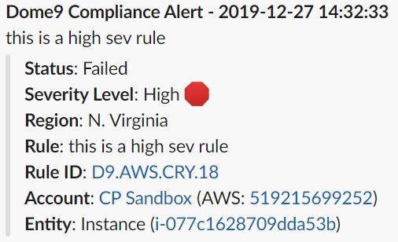

# Check Point Dome9 Compliance & Governance - Slack Integration 
AWS Lambda function which consumes Dome9 Compliance findings via SNS, pretty formats, and pushes to the defined slack channel. Filter for severity level is supported.



# Flow
Dome9 Contiuous Compliance -> SNS -> Lambda Function (index.js) -> Slack Webhook

## Requirements
* Check Point Dome9 License
* AWS SNS and Lambda (Node 8.10+)
* IAM Role for Lambda Execution Role
* Slack Webhook

## Setup
#### 1. Deploy Slack Webhook
1. Sign in to your Slack channel (<your channel>.slack.com)
2. Navigate to `https://<your-channel>.slack.com/apps/A0F7XDUAZ-incoming-webhooks?next_id=0`
3. Scroll to the Integration Settings section.
4. Select (or create) a Slack channel for the events from Dome9 Compliance.
5. Copy the Webhook URL. This is needed later in the Lambda environment variables section.

#### 2. Clone the repo and Package the code
```bash
git clone https://github.com/mambroziak/dome9-compliance-findings-to-slack.git
cd dome9-compliance-findings-to-slack/
zip my-function.zip index.js
```

#### 3. Create Lambda Function for Slack integration
A Lambda Execution role ARN is needed for this step.

```bash
# Provide Lambda Execution Role ARN
aws configure set region <AWS Region ID>
aws lambda create-function \
--function-name d9-compliance-findings-to-slack \
--runtime nodejs10.x \
--zip-file fileb://my-function.zip \
--handler index.handler \
--environment "Variables={hookUrl='https://hooks.slack.com/services/...',slackChannel='general',severityFilter='high,medium'}" \
--role <Lambda Execution Role ARN>
```
> Record the Lambda Function ARN for later use. 

#### 4. Create SNS Topic for Compliance Findings
```bash
aws sns create-topic --name dome9-compliance-topic
```
> Record the SNS Topic ARN for later use. 

#### 5. Add permissions to allow Dome9 to publish to SNS Topic
```bash
# Provide SNS Topic ARN
aws sns add-permission \
--label d9-to-sns \
--aws-account-id 634729597623 \
--action-name Publish \
--topic-arn <SNS Topic ARN>
```

#### 6. Create the mappings between the two services
```bash
# Provide SNS Topic ARN
aws lambda add-permission \
--function-name d9-compliance-findings-to-slack \
--statement-id d9-sns-to-slack \
--action "lambda:InvokeFunction" \
--principal sns.amazonaws.com \
--source-arn <SNS Topic ARN>

# Provide SNS Topic and Lambda Function ARNs
aws sns subscribe \
--protocol lambda \
--topic-arn <SNS Topic ARN> \
--notification-endpoint <Lambda ARN>
```

## 7. Set Lambda Environment Variables
Upadte the Lambda environment variables with the appropriate values.

| Env. Variable    | Description                                                                 | Default value |
|------------------|-----------------------------------------------------------------------------|---------------|
| `hookUrl `       | Slack Webhook URL                                                           | |
| `slackChannel`   | Individual channel to post to                                               | general |
| `severityFilter` | Compliance findings with matching severity will be posted (CSV - no spaces) | high,medium |

## 8. Create Dome9 Notification Policy of SNS
1. Goto `https://secure.dome9.com/v2/compliance-engine/notifications`
2. Click *Add Notification*.
3. Provide the SNS Topic ARN in the *SNS notification...* field. See example below.

4. Click *Save*.

## 9. Setup Continuous Compliance
1. Goto `https://secure.dome9.com/v2/compliance-engine/continuous-compliance`
2. Map the desired accounts to the Notification Policy created in the previous step.

Setup is complete! It may take up to an hour for the first message to be sent.